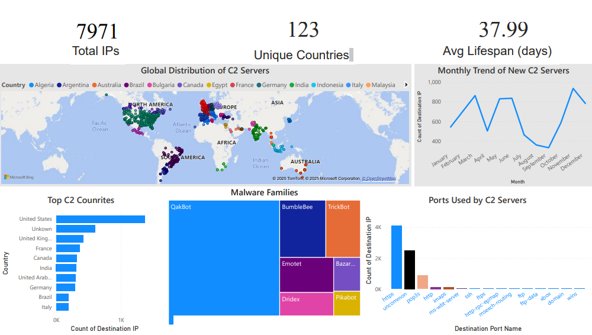

# 🛡️ C2 Threat Intelligence Data Enricher

## 📌 Overview
This project provides Python utilities to **automatically fetch, clean, and enrich malware Command-and-Control (C2) server IP datasets** from [Feodo Tracker (abuse.ch)](https://feodotracker.abuse.ch/).  
The enriched dataset can then be fed into **Power BI** to create an interactive **Threat Intelligence Dashboard**.

---

## 🌍 Data Source
- **Feodo Tracker (abuse.ch)**:  
  We pull the **Aggressive C2 IP Blocklist** directly from:  
  👉 [https://feodotracker.abuse.ch/downloads/ipblocklist_aggressive.csv](https://feodotracker.abuse.ch/downloads/ipblocklist_aggressive.csv)  
- This dataset contains known **malicious IPs**, their ports, malware families, and related metadata.  
- Disclaimer: Data is © abuse.ch, used for educational & research purposes only.

---

## ⚙️ Scripts

### 1. `latestDataset.py`
- Downloads the latest **Aggressive IP Blocklist** from Feodo Tracker.  
- Cleans the file:
  - Removes banner/footer lines
  - Ensures a clean CSV header
- Saves it as:
  - `data/feodo_aggressive_YYYYMMDD.csv` (dated copy)
  - `data/latest_feodo_aggressive.csv` (stable pointer for pipelines)

---

### 2. `datasetEnricher.py`
- Enriches the raw dataset with:
  - 🌍 **Geolocation & ASN info** (via ip-api.com batch API)
  - 🔌 **Port service mapping** (e.g., `443 → https`, `25 → smtp`, else marked as `uncommon`)
  - ⏳ **C2 server lifespan** (days online, based on first_seen vs last_online)
- Outputs an enriched CSV (`latest_feodo_enriched.csv`) ready for analysis.
- Uses a local **cache (`ip_geo_cache.json`)** to avoid re-querying the same IPs.

---

## 📊 Feeding Data into Power BI

The enriched dataset is then loaded into **Power BI Desktop** to build an interactive dashboard:

### 🔹 Example Dashboard Visuals
- 🌍 **Global Map** → C2 server distribution by country & ASN
- 📊 **Top Countries** → Which regions host the most malicious IPs
- 🦠 **Malware Families** → Dridex, Emotet, TrickBot, etc.
- 🔌 **Ports Used** → Common vs uncommon ports
- 📈 **Timeline** → New malicious IPs detected by month
- ⏳ **Server Lifespan** → How long C2 servers remain active

📑 Power BI Sample Dashboard
[View the full report (PDF)](docs/report.pdf)

<p align="center">
  
</p>

---

## 🚀 How to Run

### 1️⃣ Download the latest dataset
```bash
python latestDataset.py
python datasetEnricher.py -i input.csv -o output.csv